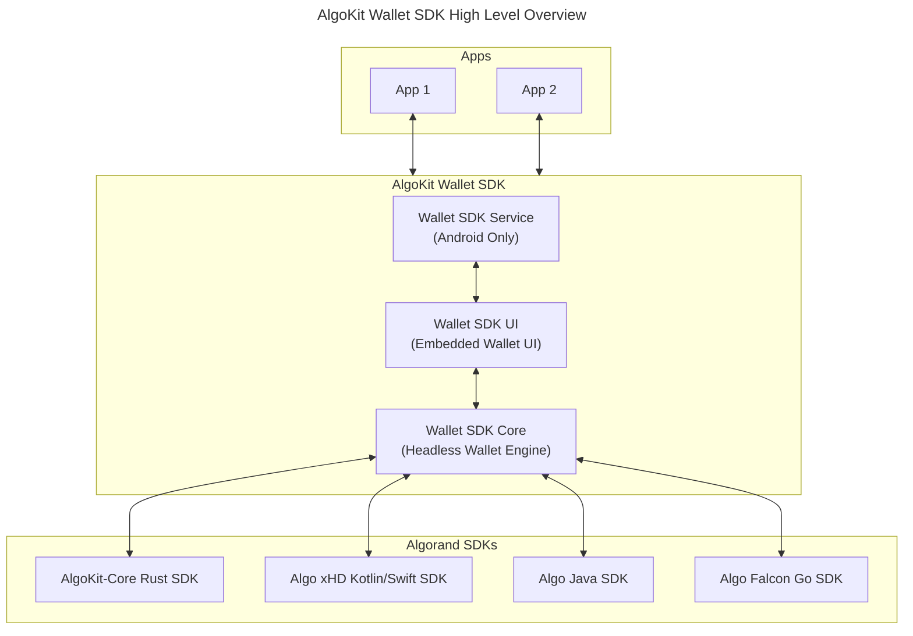
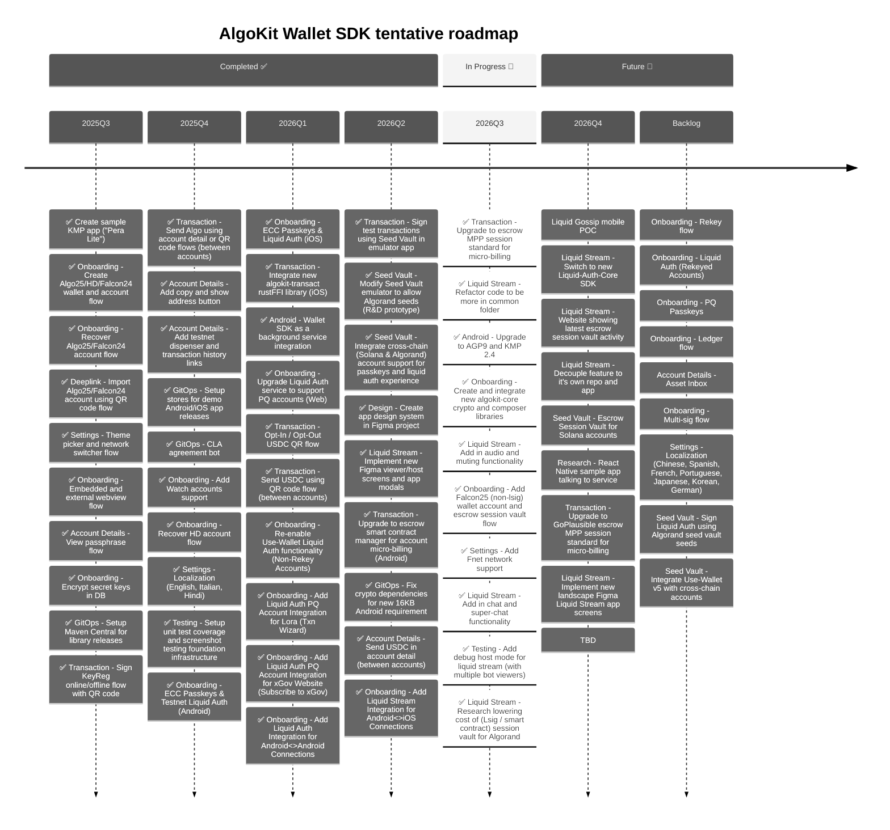

# AlgoKit Wallet SDK

[](https://central.sonatype.com/artifact/com.michaeltchuang.algokit.walletsdk/wallet-sdk-ui)
[](https://central.sonatype.com/artifact/com.michaeltchuang.algokit.walletsdk/wallet-sdk-core)

This mobile utils library project provides common wallet UI components and screens out of the box, allowing native developers to skip building standard wallet functionality and focus more on unique, value-added features for their mobile applications.

## How to Use

Add the following to your `build.gradle.kts`:
```kotlin
dependencies {
    implementation("com.michaeltchuang.algokit.walletsdk:wallet-sdk-ui:3.202603.3")
    implementation("com.michaeltchuang.algokit.walletsdk:wallet-sdk-core:3.202603.3")
}
```

> **Note:** Check Maven Central for the latest
> versions: [wallet-sdk-ui](https://central.sonatype.com/artifact/com.michaeltchuang.algokit.walletsdk/wallet-sdk-ui) | [wallet-sdk-core](https://central.sonatype.com/artifact/com.michaeltchuang.algokit.walletsdk/wallet-sdk-core)

## Overview



The demo apps (Android & iOS) in this repo demonstrate `wallet-sdk` library usage through a simplified "Pera-lite" sample wallet application. Current and planned features include:

- Create and recover accounts (Algo25, Universal HD, Falcon24)
- Theme customization
- Network switching between mainnet/testnet (code hasn't been audited, so use mainnet at your own risk)
- QR code scanning for account imports and keyreg transactions
- Algo-only & USDC experience for now (to swap memecoins...please use Pera app, Haystack app, etc)
- Account detail screen
- Passphrase management
- Localization

AlgoKit Wallet SDK currently uses UI theming inspired by [Pera Android](https://github.com/perawallet/pera-android) as a placeholder until official Algorand Foundation branding guidelines are available.



## Project structure

This repo has the following modules:

- **sharedDemoApp**: A [Compose Multiplatform](https://github.com/JetBrains/compose-multiplatform) shared demo module that demonstrates `wallet-sdk` usage across platforms. Shared UI, navigation, view models, common abstractions, and reusable Android `actual` implementations live here. Android-specific code in `sharedDemoApp/src/androidMain` should support shared APIs or reusable shared demo behavior.
- **androidDemoApp**: The installable Android demo app shell. This module owns Android app entry points, manifest/package identity, app icons, Play/App Bundle configuration, and host-only Android wiring while depending on `sharedDemoApp` for reusable demo functionality.
- **iosDemoApp**: The iOS demo app shell. Open this module in Xcode if needed; it consumes the Kotlin framework produced by `sharedDemoApp`.
- **wallet-sdk-core**: The AlgoKit Wallet SDK core module - a headless wallet utils library built with [Kotlin Multiplatform](https://developer.android.com/kotlin/multiplatform). It provides foundational wallet functionality and is built on top of [AlgoKit-Core SDK](https://github.com/algorandfoundation/algokit-core), [Algo xHD Swift SDK](https://github.com/algorandfoundation/xHD-Wallet-API-swift), [Algo xHD Kotlin SDK](https://github.com/algorandfoundation/xHD-Wallet-API-kt), [Algo Java SDK](https://github.com/algorand/java-algorand-sdk), and [Algo Go SDK](https://github.com/perawallet/algorand-go-mobile-sdk).
- **wallet-sdk-ui**: The AlgoKit Wallet SDK UI module - an embedded wallet utils library built with [Compose Multiplatform](https://github.com/JetBrains/compose-multiplatform). This module extends wallet-sdk-core and provides ready-to-use UI components for developers who want an integrated wallet interface in their applications.
- **serviceDemoApp**: A secondary Android-only demo app that tests service functionality exposed through the shared demo/app integration.

This project is developed using [Android Studio](https://developer.android.com/studio) (stable version) and the [Kotlin Multiplatform Plugin](https://plugins.jetbrains.com/plugin/14936-kotlin-multiplatform). As a mobile development project, it is primarily developed on macOS, support for Windows and Linux is quite limited.  We also follow the [KMP compatibility guide](https://www.jetbrains.com/help/kotlin-multiplatform-dev/multiplatform-compatibility-guide.html).

## Screenshots

#### Running Screenshot Tests

**Record/Generate Reference Images:**

```bash
./gradlew :wallet-sdk-ui:executeScreenshotTests -Precord
```

This command will run all screenshot tests and save the captured screenshots as reference images.

```bash
./gradlew :wallet-sdk-ui:executeScreenshotTests -Pandroid.testInstrumentationRunnerArguments.class=com.michaeltchuang.walletsdk.ui.settings.screens.PasskeysScreenshotTest -Precord
```

This command will run screenshot tests for a single class and save the captured screenshots as reference images.

**Verify Screenshots:**

```bash
./gradlew :wallet-sdk-ui:executeScreenshotTests
```

This command will run the tests and compare current screenshots against the previously recorded
reference images. If there are differences, the test will fail and generate a comparison report.

**Screenshot Default Storage Location:**

- `wallet-sdk-ui/screenshots/debug/*.png`

> **Note:** Screenshot tests require an Android device or emulator to be connected.

### Sample App - Accounts List

#### Fetching All Accounts Flow


### Wallet-SDK Screens

**Interactive Screenshot Viewer:**

View all Wallet SDK screens with an interactive gallery that allows you to filter by locale 
(English, Hindi, Italian), theme (Dark/Light), and view various user flows. [Open Screenshot Gallery →](https://michaeltchuangllc.github.io/algokit-walletsdk-kmp/screenshots/index.html)

## Architecture

# Database Schema

```mermaid
---
title: AlgoKitDatabase
---
erDiagram
    custom_account_info {
        String algo_address PK
        String custom_name
        Int order_index
        Boolean is_backed_up
    }
    custom_hd_seed_info {
        Int seed_id PK,FK
        String entropy_custom_name
        Int order_index
        Boolean is_backed_up
    }
    algo_25 {
        String algo_address PK
        ByteArray encrypted_secret_key
    }
    ledger_ble {
        String algo_address PK
        String device_mac_address
        Int account_index_in_ledger
        String bluetooth_name
    }
    no_auth {
        String algo_address PK
    }
    hd_seeds {
        Int seed_id PK
        ByteArray encrypted_entropy UK
        ByteArray encrypted_seed UK
    }
    falcon_24 {
        String algo_address PK
        Int seed_id FK
        ByteArray public_key UK
        ByteArray encrypted_secret_key
    }
    falcon_25 {
        String algo_address PK
        ByteArray public_key
        ByteArray encrypted_private_key
        ByteArray encrypted_entropy
        ByteArray encrypted_seed
    }
    hd_keys {
        String algo_address PK
        ByteArray public_key UK
        ByteArray encrypted_private_key
        Int seed_id FK
        Int account
        Int change
        Int key_index
        Int derivation_type
    }
    sites {
        Long id PK
        String url UK
        String name
    }
    passkey_table {
        String credential_id PK
        Long site_id FK
        String address
        String user_id
        String user_name
        String user_display_name
        Long last_used_time_ms
    }
    seed_vault {
        String public_key PK
        String address
        String chainId
        String account_name
    }
    mpp_vouchers {
        String channel_id_base64 PK
        String session_id UK
        String viewer_address UK
        String viewer_public_key_base64
        String signature_base64
        Long total_amount_claimed_micro_usdc
        String creator_address
        Long block_number
        String note
    }
    custom_hd_seed_info }|--|| hd_seeds : link
    hd_keys }|--|| hd_seeds : link
    falcon_24 }|--|| hd_seeds : link
    passkey_table }|--|| sites : link
```



## Contributing
Development happens in this open source repo for the AlgoKit Wallet SDK. Algorand community is always welcome to contribute by reviewing or opening new pull requests.

## Testing

This project is tested with BrowserStack (open source license).

For QR code importing, you can use a tool like [Cyber Chef](https://gchq.github.io/CyberChef/#recipe=Generate_QR_Code('PNG',5,4,'Medium')) to get QR codes online

### 24 word account

```json
{
  "mnemonic": "define claw hungry wave umbrella boost blind never muscle also grab gaze fluid echo predict describe turkey unaware dash phone urge crunch eyebrow abstract team"
}
```

### KeyReg offline (account address should exist on device)
```
algorand://ANUR5SYMURBFD3ELITINYNTHVAKKBCWJ7LGHJRPMQM3KQG25ENMIHYEBNY?type=keyreg
```

### Asset Opt-In (select account screen will pop up after scanning) - USDC (testnet - 10458941, mainnet - 31566704)
```
algorand://?amount=0&asset=10458941
```

### Algo Transfer (receiver address & amount in microAlgos)
```
algorand://7N54HZSGBRQF7FW6YNC6F5H42AT5OXN3F5OQDAXF6H6PDFHNXIEBCJFHOY?amount=1000000&note=1_ALGO_Transfer
```

### ASA Transfer (receiver address & amount in microAlgos) - USDC (testnet - 10458941, mainnet - 31566704)
```
algorand://7N54HZSGBRQF7FW6YNC6F5H42AT5OXN3F5OQDAXF6H6PDFHNXIEBCJFHOY?amount=1000000&asset=10458941&note=1_ALGO_Transfer
```

### Liquid Auth (sample uri)
```
liquid://michaeltchuang.ngrok.dev/?requestId=019c3ff0-70fd-7663-823b-2ce5bbc5fca6
```
